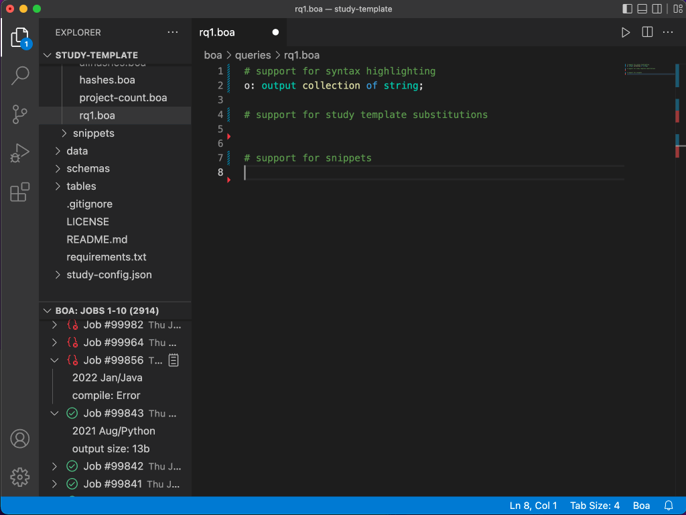
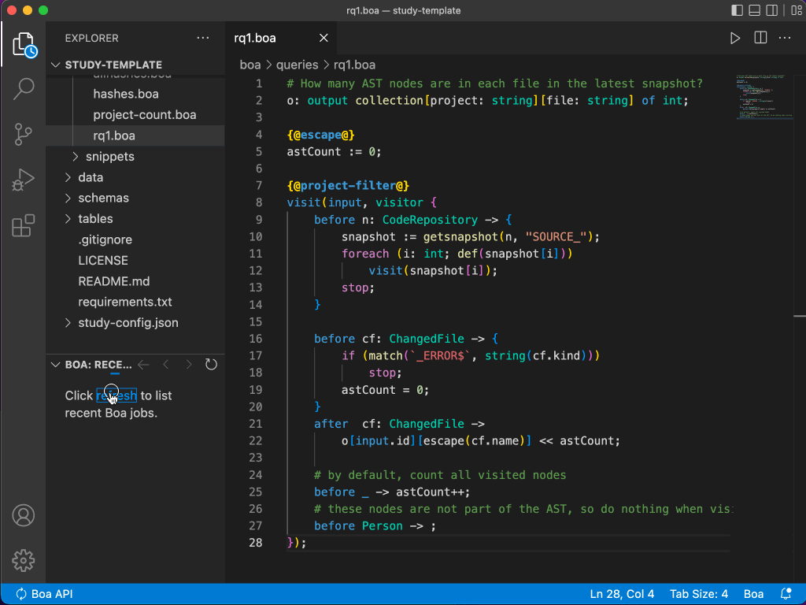
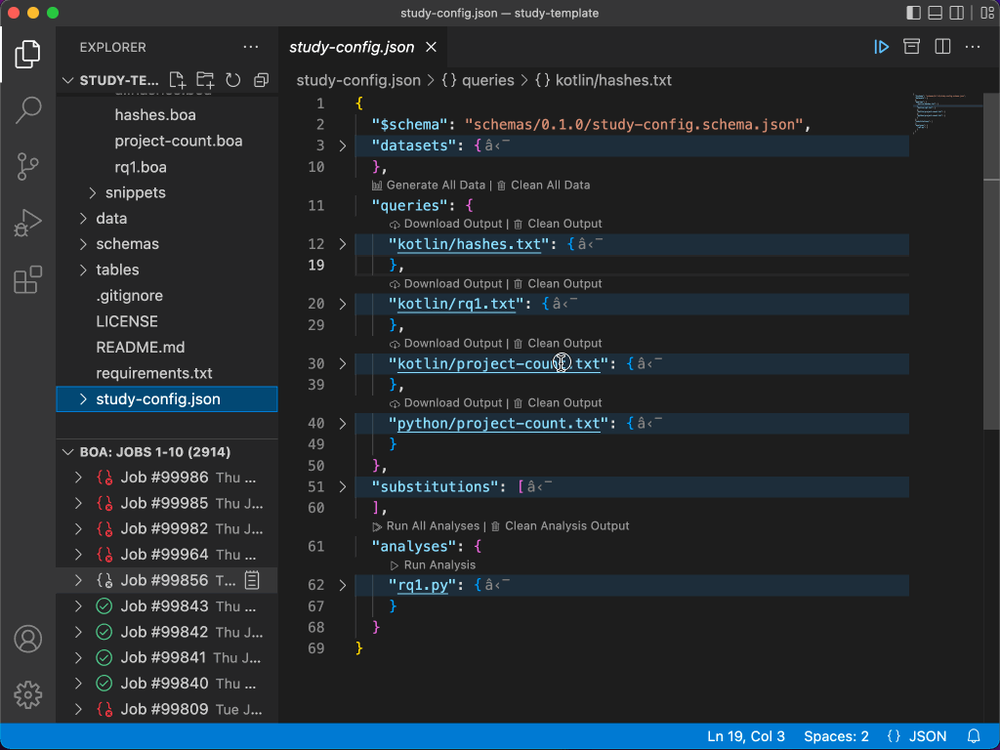

# Boa Language and Infrastructure

This is the extension for the [Boa Language and Infrastructure](https://boa.cs.iastate.edu/).

**Note**: While you can use this extension to write Boa queries, most functionality (like submitting/managing jobs) requires having a user/password on the Boa infrastructure.  If you do not yet have one, please [request a user](https://boa.cs.iastate.edu/request/).

## Features

### Editing Boa Queries

This extension provides support for writing Boa queries:

This includes things like syntax highlighting, the ability to insert useful code snippets, code completion, and support for study template substitutions (templates).

### Submitting and Managing Boa Jobs

The extensions also provides support for submittin queries to Boa and managing existing jobs:

This allows you to effectively stay in the IDE and never need to go to the Boa website.

### Using Boa's Study Template

Boa provides a [study template](https://github.com/boalang/study-template) to help manage running empirical studies using Boa.

This plugin tightly integrates with the study template:

Providing support for managing the substitutions, running and downloading query output, and running analyses.

## Extension Settings

This extension contributes the following settings:

- `boalang.api.endpoint`:     Boa API endpoint URL
- `boalang.login.username`:   Boa API username
- `boalang.dataset.favorite`: Favorite Boa dataset
- `boalang.joblist.pagesize`: Number of jobs to show in the jobs tree view
- `boalang.output.size`:      Size (in bytes) to limit displaying query outputs
- `boalang.joblist.autoload`: Should the jobs tree view refresh on extension activation?

## Changelog

Check the [CHANGELOG.md](CHANGELOG.md) for a log of changes made in each version.

## Reporting Issues

This extension is currently marked as a beta release.  Bugs are probably present.

Please be sure to check the list of known issues and report any that are missing:\
https://github.com/boalang/vscode/issues

## Contributing

The source code for this extension is hosted on [GitHub](https://github.com/boalang/vscode). Contributions, pull requests, suggestions, and bug reports are greatly appreciated.

Please see the [CONTRIBUTING.md](CONTRIBUTING.md) file for more details on building and debugging the extension.

## License

This extension is licensed under the Apache 2.0 license.  See the [LICENSE](LICENSE) file for more details.
